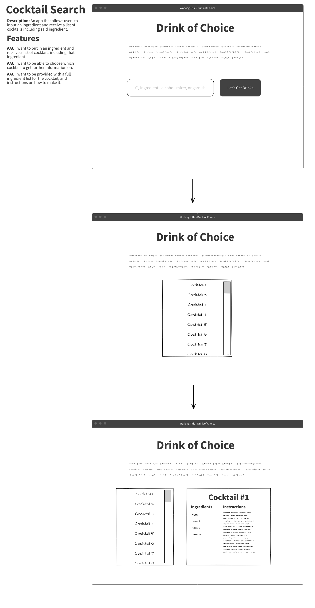
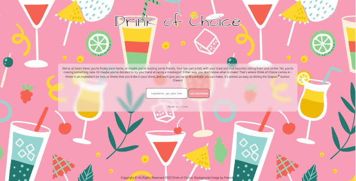
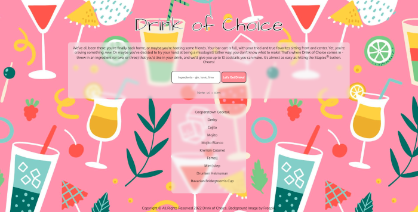
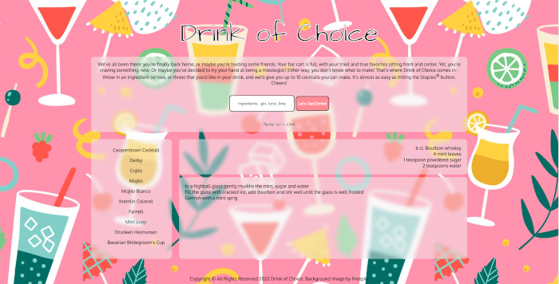

com# Drink of Choice

## Description

An app that allows users to input an ingredient and receive a list of up to 10 cocktails containing said ingredient.

## Technologies Used

- HTML5
- CSS3
- Javascript/jQuery
- Cocktail API from API Ninjas
- Git/Github
- (Hosting location)

## Screenshots

## Getting Started

[Visit the deployed app](https://audemusprime.github.io/cocktail-search/)

## Future Enhancements

- Allow users to save favorite cocktails from their search
